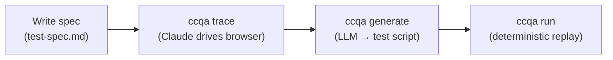

# ccqa

**Your Claude subscription already includes a QA engineer.**

ccqa turns Claude Code into a browser test recorder.

Write a spec in Markdown, run `ccqa trace`, and Claude drives your app via [agent-browser](https://github.com/vercel-labs/agent-browser) — a lightweight headless browser CLI that runs anywhere without a browser driver or Playwright setup. Because the agent controls the browser through a simple CLI interface, it can handle login flows, intermediate screens, and dynamic UI the same way a human would.

Every action is recorded as structured data and compiled into a deterministic test script you can run in CI. No extra API key. Just `claude`.

## How it works



`trace` invokes Claude Code with your spec. Claude drives the browser step by step via [agent-browser](https://github.com/vercel-labs/agent-browser), recording every action as structured data. `generate` compiles that data into a vitest-compatible script. `run` replays it deterministically — no LLM involved.

## Install

Add ccqa as a dev dependency in your project:

```bash
pnpm add -D ccqa vitest
# or
npm install -D ccqa vitest
```

Then invoke the CLI via your package runner:

```bash
pnpm exec ccqa trace tasks/create-and-complete
# or
npx ccqa trace tasks/create-and-complete
```

ccqa requires Node.js **20+** at runtime. The peer dependencies [Claude Code](https://docs.anthropic.com/en/docs/claude-code) and [agent-browser](https://github.com/vercel-labs/agent-browser) must also be installed:

```bash
pnpm add -D @anthropic-ai/claude-code agent-browser
```

## Usage

**1. Write a spec**

```markdown
<!-- .ccqa/features/tasks/test-cases/create-and-complete/test-spec.md -->
---
title: Create a task and mark it complete
baseUrl: http://localhost:3000
---

## Steps

### Step 1: Log in
- **Instruction**: Fill in email and password, submit the form
- **Expected**: Redirected to /dashboard, user avatar visible in the header

### Step 2: Create a new task
- **Instruction**: Click "New Task", fill in the title "Fix login bug", set priority to High, save
- **Expected**: Task appears in the task list with status "Open"

### Step 3: Mark the task as complete
- **Instruction**: Open the task "Fix login bug", click "Mark as complete"
- **Expected**: Task status changes to "Done", task moves to the completed section
```

**2. Trace — Claude drives the browser and records every action**

```bash
ccqa trace tasks/create-and-complete
```

```
▶ trace  tasks/create-and-complete
  spec    Create a task and mark it complete
  url     http://localhost:3000
  steps   3

Running agent-browser session...
  ● step-01  Log in
  ● step-02  Create a new task
  ● step-03  Mark the task as complete

  trace   .ccqa/features/tasks/test-cases/create-and-complete/actions.json
  actions 24
  status  PASSED
```

**3. Generate — convert recorded actions into a replayable test**

```bash
ccqa generate tasks/create-and-complete
```

**4. Run — replay deterministically, no LLM involved**

```bash
ccqa run tasks/create-and-complete
```

## Setup Specs — Reusable shared procedures

Setup specs let you define reusable procedures (login, data preparation, etc.) that run before your test steps. Define once, use across multiple test specs.

### 1. Write a setup spec

```markdown
<!-- .ccqa/setups/login/setup-spec.md -->
---
title: "Login"
placeholders:
  loginUrl:
    dummy: "http://localhost:3000/login"
    description: "Login page URL"
  email:
    dummy: "user@example.com"
    description: "Email address"
  password:
    dummy: "secret"
    description: "Password"
---

## Steps

### Step 1: Open login page
- **Instruction**: Navigate to {{loginUrl}}
- **Expected**: Login form is displayed

### Step 2: Enter credentials and log in
- **Instruction**: Enter email {{email}} and password {{password}}, then submit
- **Expected**: Login succeeds
```

The `placeholders` section defines variables with `dummy` values. During `trace-setup`, the dummy values are used for actual browser operation. During `generate-setup`, they are reverse-replaced with `{{key}}` placeholders.

### 2. Trace the setup

```bash
ccqa trace-setup login
```

### 3. Generate and validate the setup

```bash
ccqa generate-setup login
```

This generates `test.dummy.spec.ts` with dummy values, runs vitest to validate, and applies auto-fix. On success, it reverse-replaces dummy values with placeholders and saves `test.spec.ts`.

If auto-fix fails, edit `test.dummy.spec.ts` manually and re-run:

```bash
ccqa generate-setup login --from-dummy
```

### 4. Reference from test specs

```markdown
---
title: Create a task
baseUrl: http://localhost:3000
setups:
  - name: login
    params:
      loginUrl: "http://localhost:3000/login"
      email: "admin@example.com"
      password: "AdminPass123"
---

## Steps
### Step 1: Create a new task
...
```

When you run `ccqa trace` or `ccqa generate`, the setup's test body is loaded, placeholders are replaced with `params` values, and it runs before your test steps — sharing the same browser session.

## What gets generated

`ab()` is a thin wrapper around [agent-browser](https://github.com/vercel-labs/agent-browser) — a headless browser CLI. Each call spawns `agent-browser <command>` as a subprocess and throws if it exits non-zero. No browser driver setup, no async/await, no `.waitFor()`.

```typescript
// .ccqa/features/tasks/test-cases/create-and-complete/test.spec.ts
import { test } from "vitest";
import { ab, abWait, abAssertUrl, abAssertTextVisible, abAssertEnabled } from "ccqa/test-helpers";

process.env.AGENT_BROWSER_SESSION = `ccqa-run-${Date.now()}`;

test("setup: login", () => {
  ab("cookies", "clear");
  ab("open", "http://localhost:3000/login");
  ab("fill", "[placeholder='Email']", "admin@example.com");
  ab("fill", "[type='password']", "AdminPass123");
  ab("press", "Enter");
}, 3 * 60 * 1000);

test("Create a task", () => {
  ab("open", "http://localhost:3000");

  // Create a new task
  ab("click", "[aria-label='New Task']");
  ab("fill", "[placeholder='Task title']", "Fix login bug");
  ab("select", "[aria-label='Priority']", "High");
  ab("click", "[aria-label='Save']");
  abAssertTextVisible("Fix login bug");
  abAssertTextVisible("Open");
}, 5 * 60 * 1000);
```

Setup and test share the same `AGENT_BROWSER_SESSION` — login state carries over. Each run starts with `cookies clear` to ensure a clean session.

## Assertions

During `trace`, Claude verifies each step with at least two independent signals and emits structured assertions. These become typed helper calls in the generated script:

| Assert | What it checks |
|--------|---------------|
| `abAssertTextVisible(text)` | Text appears on page (waits up to 30s) |
| `abAssertUrl(pattern)` | Current URL contains pattern |
| `abAssertEnabled(selector)` | Button/input is enabled |
| `abAssertDisabled(selector)` | Button/input is disabled |
| `abAssertVisible(selector)` | Element is visible |
| `abAssertNotVisible(selector)` | Element is hidden |
| `abAssertChecked(selector)` | Checkbox is checked |
| `abAssertUnchecked(selector)` | Checkbox is unchecked |

Assertions are stability-aware: Claude skips timestamps, session IDs, and exact counts that vary between runs.

## Auto-fix

If the generated script fails (timing issues, page not ready), `generate` uses an LLM to analyze the failure log and insert `sleep` at the right positions. Control how many attempts with `--max-retries`:

```bash
ccqa generate tasks/create-and-complete --max-retries 5
```

## Commands

```
ccqa trace <feature/spec>          Record browser actions for a test spec
ccqa generate <feature/spec>       Generate test script from recorded actions
ccqa run [feature/spec]            Execute generated test scripts

ccqa trace-setup <name>            Record browser actions for a setup spec
ccqa generate-setup <name>         Generate and validate setup test script
  --from-dummy                      Resume from manually edited test.dummy.spec.ts
```

## File structure

```
.ccqa/
  setups/
    login/
      setup-spec.md              # Setup definition with placeholders
      test.spec.ts               # Generated setup script (with {{placeholders}})
  features/
    tasks/
      test-cases/
        create-and-complete/
          test-spec.md           # Test definition (references setups)
          actions.json           # Recorded actions from trace
          test.spec.ts           # Generated test script
```

## Why not write Playwright tests by hand?

| | ccqa | Hand-written Playwright |
|---|---|---|
| Write selectors | Claude picks them from ARIA snapshots | You inspect the DOM |
| Handle timing | Recorded wait commands, auto-fix sleep | `waitFor`, `expect().toBeVisible()` |
| Assertions | Auto-generated from verified signals | Written manually |
| Login / setup | Shared setup specs with placeholders | Custom fixtures per project |
| Update after UI change | Re-run `trace` | Find and update every affected locator |
| Runs in CI | Yes (deterministic replay, no LLM) | Yes |

## License

MIT
